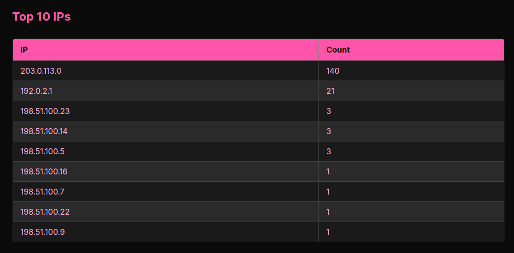
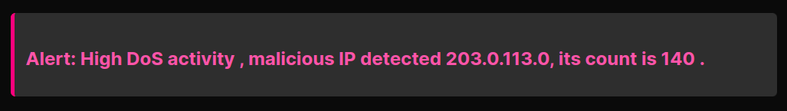
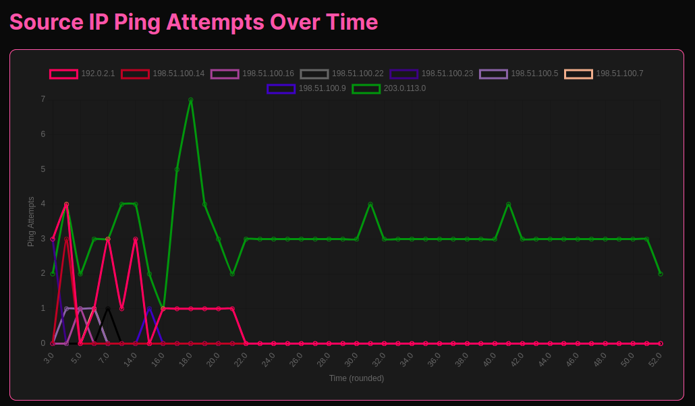

## This is my capstone project with MentorMeXGoogle cybersecurity track

## WellSecure : Healthcare API DoS Threat Analyzer
Simple Flask web application (demo dashboard) that:
1. Lets the user view uploaded logs (from healthcare traffic).
2. Performs basic DoS detection from CSV data (loaded by pandas).
3. Shows a summary on a web dashboard (HTML page) using Flask templates.

## Description:
This is a simple Flask-based MVP dashboard that simulates how a healthcare system could be attacked by DoS, and visualizes logs (from availble data) to alert or inform admin staff.
I am using the  Wireshark TCP/HTTP log csv file provided during the certificate as a refrence of log data, the csv is a Dos attack, from a single ip adress: `203.0.113.0`.
Note: Its assumed the data is in a healthcare context.

## MVP Goals:
A web interface that uploads log data (`data/Wireshark_TCP_HTTP_log.csv`).

Backend processes: Flask framework;
1. Number of potential DoS entries.
2. Plot, for each timestamp, how many attempts each source IP made.
3. A short summary: “Alert: High DoS activity , malicious IP detected {{ top_ip }}”

## Dependencies:
Run `pip install -r requirements.txt` to install dependencies.
- Flask
- pandas
- HTML/CSS for the dashboard

## App preview:
 
 
 